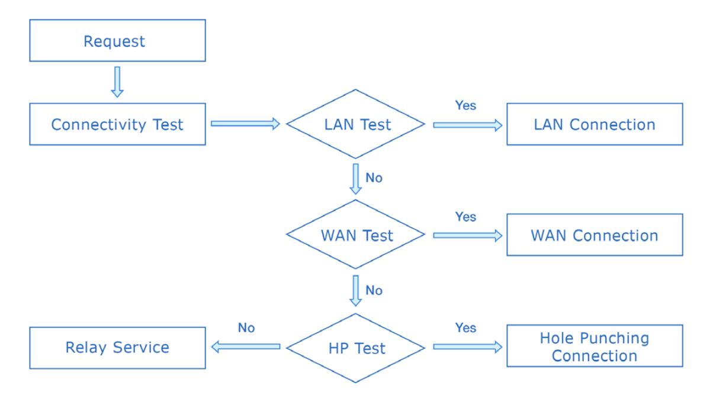
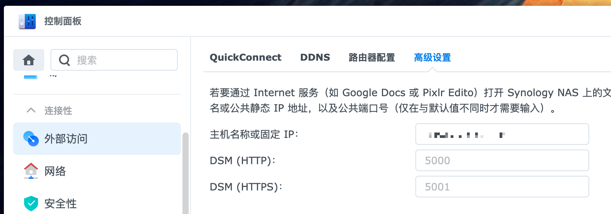

# 群晖 frp 内网穿透配置（基于 Docker）与域名配置

最近亚马逊群晖 nas 价格新低，购入了一台 DS220+ 双盘位 nas，奈何租房没有公网IP，群晖自带的 Quick Connect 转发又太慢，为了外网也能访问到 nas，只好自己配置内网穿透。

<!--truncate-->

目前主流的内网穿透方案包括 [frp](https://github.com/fatedier/frp) 和 [nps](https://github.com/ehang-io/nps)，其中 nps 的优势是可以直接从 web 页面上进行系统配置。 但考虑到一般也不会频繁调整，所以最终采用了更加成熟的 frp 进行内网穿透。 

## 构建镜像

为了尽量不侵入群晖的系统环境，群晖上的第三方服务建议都使用 Docker 进行安装部署，frp 官方并没有提供 Docker 镜像，所以我自己 build 了一份，有需要的话可以直接用。

镜像地址： https://registry.hub.docker.com/r/gaoliang/frp/ 

源码： https://github.com/gaoliang/Dockerfiles

这个镜像启动时会自动判断是否存在 /frpc.ini 或者 /frps.ini 文件，如果存在就对应的启动客户端或者服务端，所以要把正确命名的配置文件 mount 到根目录下。

群晖自带的 Docker UI 并不是很好用，配置起来有点繁琐，所以干脆开 ssh，使用自带的 docker-compose 来管理。

## 客户端配置

客户端（群晖）docker-compose.yml

```yaml
version: "3"
services:
  frp-client:
    image: gaoliang/frp:latest
    network_mode: host
    volumes:
      - ./frpc.ini:/frpc.ini
    restart: always
    container_name: frp-client
```

客户端 frpc.ini，这里转发了多个端口，因为群晖的各种应用需要的端口是不一样的。 

```ini
[common]
server_addr = 服务端的 IP
server_port = 7777
token = ****这里是和服务端一致的token****

[dsm-ssh]
type = tcp
local_ip = 127.0.0.1
local_port = 22
remote_port = 6000

[dsm-http]
type = tcp
local_ip = 127.0.0.1
local_port = 5000
remote_port = 5000

[dsm-https]
type = tcp
local_ip = 127.0.0.1
local_port = 5001
remote_port = 5001

[synology-drive]
type = tcp
local_ip = 127.0.0.1
local_port = 6690
remote_port = 6690

[synology-webdav]
type = tcp
local_ip = 127.0.0.1
local_port = 5006
remote_port = 5006

```


## 服务端配置

服务端（用来转发的服务器）docker-compose.yml

```yaml
version: "3"
services:
  frp-client:
    image: gaoliang/frp:latest
    network_mode: host
    volumes:
      - ./frps.ini:/frps.ini
    restart: always
    container_name: frp-server
```

frps.ini

```ini
[common]
bind_port = 7777
token = ****自己设置的token****
```


## 域名与 https 配置

frp 配置完成后，后台其实就可以用 ip:5001 直接访问了。 不过因为访问的是 https 端口，而群晖默认使用的是自签名的证书，所以会提示证书错误。 

为了解决这个问题，需要把自己的域名解析到对应的公网 IP，然后在 群晖 设置 > 安全性 > 证书中导入域名的证书，设置为默认证书，再通过域名访问，就不会报错了。 这里我使用的是腾讯云提供的免费证书。 


## Quick Connect 自动跳转到自定义域名

Quick Connect 是群晖提供的跳转和转发服务，它能自动判断当前的网络环境，选择最佳的连接方式。

具体的细节可以查看官方的 [Quick Connect 白皮书](https://global.download.synology.com/download/Document/Software/WhitePaper/Firmware/DSM/All/enu/Synology_QuickConnect_White_Paper.pdf)

简而言之，Quick Connect 会优先尝试本地局域网联机（速度最快），然后是广域网连接（IP直连、端口转发、DDNS），最后再尝试使用 Quick Connect 的打洞和转发服务。



 但是因为我们使用的 frp ，既不是端口转发，也不是 DDNS，Quick Connect 并不知道可以通过我们自己的域名来访问到我们的 nas，所以当在外网通过 Quick Connect 连接 nas 时，还是会默认走群晖的转发服务，速度非常慢。 

因此，我们需要主动告知群晖，可以通过我们自己的域名来访问。 在控制面板，外部访问，高级设置中，设置我们的域名就可以了。 



这样，当我们在非局域网访问 http://xxxxx.quickconnect.to/ 时，就会优先跳转到内网穿透的域名上。 

而在局域网内部访问 http://xxxxx.quickconnect.to/ 时，则会自动使用局域网访问，跳转到类似于 https://192-168-0-113.xxxxx.direct.quickconnect.to:5001/ 这样的地址。 这个地址解析的结果就刚好是我们的局域网 IP，所以速度就是局域网的速度，而且 https 证书群晖也自动做了处理。 