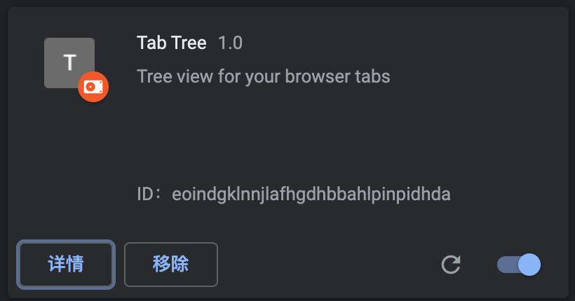

# 使用 create-react-app 脚手架构建浏览器插件 

之前用 vue2 写过一个[开发环境指示器](https://chrome.google.com/webstore/detail/environment-indicator/kgdbcpllbbnimjgoiomfdebldcofmlbl)插件，目前已经有了400多位用户，最近又有了新的 Idea，准备尝试一下用 react 来写。

<!--truncate-->

## 准备 react 脚手架

这里使用 [create-react-app](https://create-react-app.dev/) 脚手架来生成 react 代码项目结构

```bash
yarn create create-react-app tab-tree
```

执行完成后得到初始的项目结构如下

```
.
├── README.md
├── package.json
├── public
│   ├── favicon.ico
│   ├── index.html
│   ├── logo192.png
│   ├── logo512.png
│   ├── manifest.json
│   └── robots.txt
├── src
│   ├── App.css
│   ├── App.js
│   ├── App.test.js
│   ├── index.css
│   ├── index.js
│   ├── logo.svg
│   ├── reportWebVitals.js
│   └── setupTests.js
└── yarn.lock
```

此时生成的代码是为开发网页应用来设计的， 我们需要对他做一些小改动来适配浏览器插件的文件结构

## 配置浏览器插件结构

参照 chrome 的浏览器插件[文档](https://developer.chrome.com/docs/extensions/mv3/) , 我们需要对项目结构进行一些调整，以适配浏览器插件。 

### 1. 配置 manifest.json 清单文件

create-react-app 生成的 manifest.json 文件是为 [PWA](https://developer.mozilla.org/en-US/docs/Web/Manifest) 应用使用的，并不是给浏览器扩展使用的，我们需要修改成浏览器扩展的清单文件，这里采用新版 [Manifest V3](https://developer.chrome.com/docs/extensions/mv3/intro/) 格式的清单文件。

```json
{
  "name": "Tab Tree",
  "description": "Tree view for your browser tabs",
  "version": "1.0",
  "manifest_version": 3,
  "permissions": ["tabs", "storage"],
  "action": {
    "default_popup": "index.html"
  }
}
```

浏览器插件通常需要 [后台脚本](https://developer.chrome.com/docs/extensions/mv3/background_pages/), [内容脚本](https://developer.chrome.com/docs/extensions/mv3/content_scripts/),  [可选的页面](https://developer.chrome.com/docs/extensions/mv3/options/) 组成，这里我们只配置了一个 default_popup 页面，即点击浏览器图标之后，展示的页面。 

同时，我们可以移除 `public/index.html` 中对 manifest.json 的引用，因为浏览器扩展并不需要被另存为 PWA 应用。 


### 2. 构建并加载应用页面

执行 `yarn build` 可以将应用构建到 build 目录下，打开浏览器 `chrome://extensions/` 页面，选择开发者模式，加载已解压的扩展程序，选择 build 目录，就可以将插件安装到浏览器中。

 

点击菜单中的插件按钮，可以看到页面成功现实在了 popup 页面中，只不过页面大小和插件图标都没有配置。 


### 3. 配置 background.js 和 content.js

background.js 是运行在后台的 js 脚本，可以和浏览器扩展 API  进行交互，content.js 是被注入到浏览器页面中的脚本，不可以和浏览器扩展 API 交互，但是可以和 background.js 进行交互。 

如果我们不需要他们使用 webpack 进行管理，可以直接将这两个文件放在 public 目录下，然后在 manifest 文件中引用。

我们在 background.js 中调用浏览器扩展接口

```
// background.js
let color = '#3aa757';

chrome.runtime.onInstalled.addListener(() => {
  chrome.storage.sync.set({ color });
  console.log('Default background color set to %cgreen', `color: ${color}`);
});
```

然后在 manifest 文件中关联这个文件

```json
{
  "name": "Tab Tree",
  "description": "Tree view for your browser tabs",
  "version": "1.0",
  "manifest_version": 3,
  "permissions": ["tabs", "storage"],
  "action": {
    "default_popup": "index.html"
  },
  "background": {
    "service_worker": "background.js"
  }
}
```

重新 build 并加载后，点击查看视图 Service Worker，就可以看到 background 的输出了。 


## 优化插件展示

### 1. 调整 popup 窗口大小

popup 窗口目前非常小，无法展示足够的内容，需要修改 index.html 来调整，添加如下样式

```css
    <style>
      body {
        height: 600px;
        width: 600px;
      }
    </style>
```

注意，浏览器 popup 窗口的最大大小是 600 * 600， 超过的将会出现滚动条


## 参考内容

1. https://developer.chrome.com/docs/extensions/mv3/
2. https://developer.mozilla.org/en-US/docs/Mozilla/Add-ons/WebExtensions
