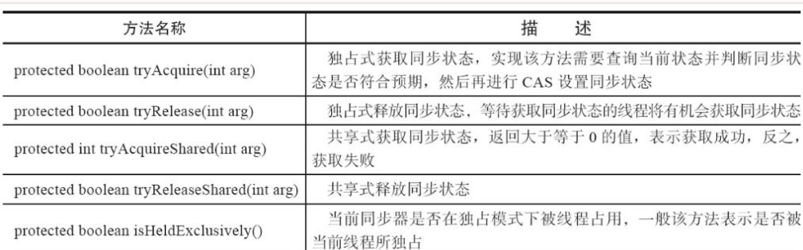
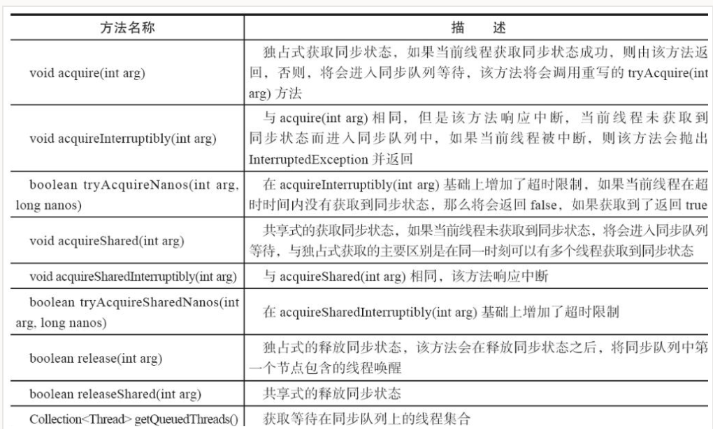
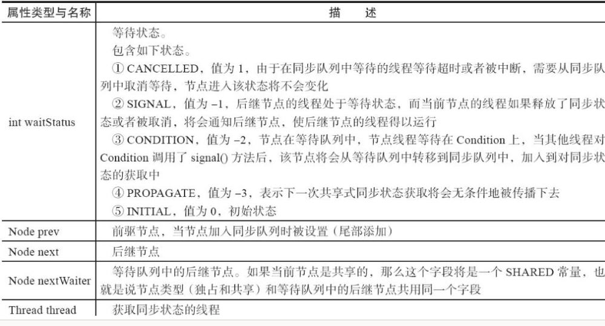
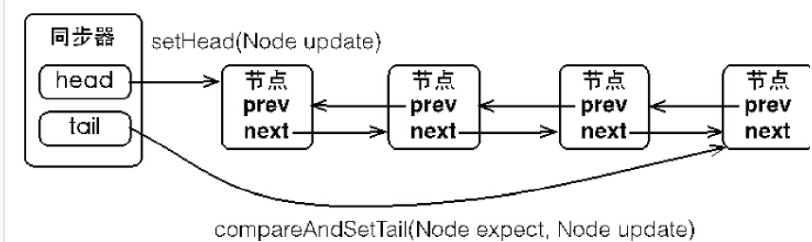
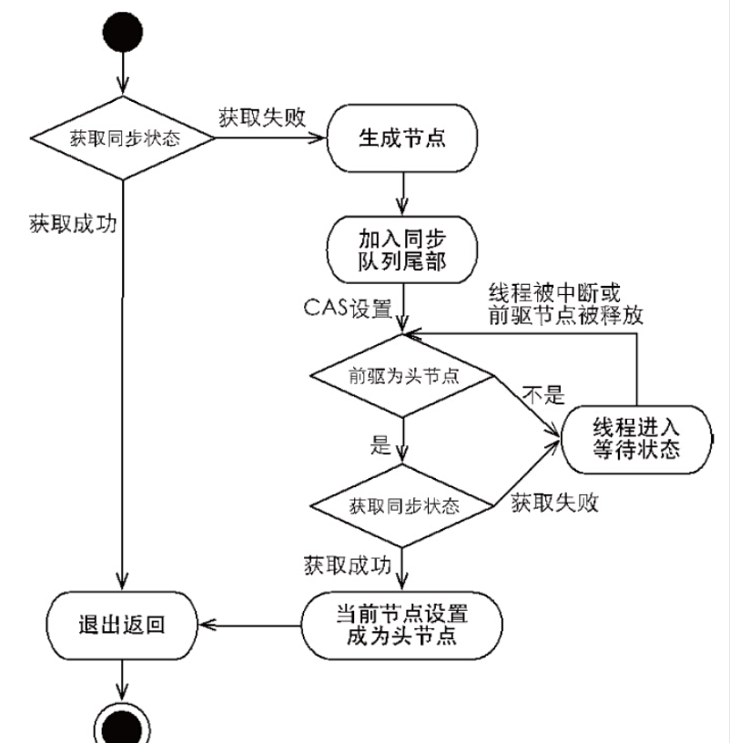

# Java 队列同步器 AQS 

## 什么是 AQS


队列同步器 AbstractQueuedSychronizer 是用来构建锁和其他各类同步组件的基础框架，他使用了一个 int 成员变量来表示同步状态，通过内置的 FIFO 队列来完成资源获取线程的排队工作。  其本质上是采用了乐观锁的思想，大量运用 CAS 自旋。 

## AQS 的核心组成

> 状态，队列，CAS 是Java 并发工具设计的三板斧

AQS 也不例外

### 状态

```
private volatile int state; 
private transient Thread exclusiveOwnerThread; //继承自AbstractOwnableSynchronizer
```

### 队列

AQS 的队列是一个 CLH 双向队列，表示所有阻塞等待锁的线程的集合。 


### CAS 操作

对于 state，head，tail，waitStatus，next 属性，都提供了 CAS 操作方法

## 如何使用 AQS

AQS 的主要使用方式是继承，子类通过继承 AQS 同步器来并实现他的抽象方法来管理同步状态，在抽象方法的实现过程中就免不了对状态进行更改，这是就需要使用同步器提供的三个方法 getState(), setState(int newState) 和 compreAndSetState(int expect, int update) 来进行操作，因为他们能够保证状态的改变是安全的。子类被推荐定义为自定义同步组件的静态内部类，同步器本身没有实现任何同步接口，他仅仅是定义了若干同步状态获取和释放的方法来自定义同步组件的使用，同步器既可以支持独占式的获取同步状态，也可以支持共享式的获取同步状态，这样就可以方便的实现不同类型的组件，例如 ReentrantLock, ReentrantReadWriteLocl 和 CountDownLatch 等。 

同步器是实现锁（也可以是任意同步组件）的关键，在锁的实现中聚合同步器，利用同步器实现锁的语义。 可以这样理解：锁和同步组件是面向使用者的，其隐藏了实现的细节；同步器是面向锁的实现者的，他简化了锁的实现方式，屏蔽了同步状态管理，线程的排队，等待与唤醒等底层操作。 锁和同步器很好的隔离了使用者和实现者所需关心的领域。 

同步器的设计是基于模版方法模式的。 使用者需要继承同步器并重写指定的方法， 随后将同步器组合在自定义同步组件的实现中，并调用同步器提供的模版方法。 这些模版方法将会调用使用者重写的方法。 

在重写时间，需要使用同步器提供的三个方法来访问或修改同步状态

- getState()：获取当前同步状态
- setState(int newState): 设置当前同步状态
- compareAndSetState(int expect, int updated): 使用 CAS 原子的设置当前状态。 

可以重写的方法如下



通常使用的同步器提供的模版方法如下：



同步器提供的模版方法基本分为三类：独占式获取与释放同步状态、共享式获取与释放同步状态与查询同步队列中的等待线程情况。 

我们尝试使用 AQS 来实现一个独占锁。 

```
package me.gaoliang.review.juc;

import java.util.concurrent.TimeUnit;
import java.util.concurrent.locks.AbstractQueuedSynchronizer;
import java.util.concurrent.locks.Condition;
import java.util.concurrent.locks.Lock;

public class Mutex implements Lock {

    // 静态内部类，自定义的同步器
    private static class Sync extends AbstractQueuedSynchronizer {

        // 是否处于独占状态
        @Override
        public boolean isHeldExclusively() {
            return this.getState() == 1;
        }

        // cas 获取锁
        @Override
        public boolean tryAcquire(int acquires) {
            if (compareAndSetState(0, 1)) {
                setExclusiveOwnerThread(Thread.currentThread());
                return true;
            }
            return false;
        }

        // 释放所
        @Override
        public boolean tryRelease(int releases) {
            if (getState() == 0) {
                throw new IllegalMonitorStateException();
            }
            setExclusiveOwnerThread(null);
            setState(0);
            return true;
        }

        // 返回一个 condition，每个condition 都包含一个 condition 队列。 
        Condition newCondition() {
            return new ConditionObject();
        }
    }

    private final Sync sync = new Sync();


    @Override
    public void lock() {
        sync.acquire(1);
    }

    @Override
    public void lockInterruptibly() throws InterruptedException {
        sync.acquireInterruptibly(1);
    }

    @Override
    public boolean tryLock() {
        return sync.tryAcquire(1);
    }

    @Override
    public boolean tryLock(long time, TimeUnit unit) throws InterruptedException {
        return sync.tryAcquireNanos(1, unit.toNanos(time));
    }

    @Override
    public void unlock() {
        sync.release(1);
    }

    @Override
    public Condition newCondition() {
        return sync.newCondition();
    }
}


```

可以看到，通过组合的方式，Mutex 类的主要实现都被代理到了内部基于 AQS 的同步器上了。 具体的实现细节，对于锁的实现者来说无需关心。 在 Mutex 的实现中，以获取锁的 lock 方法为例，只需要在方法实现中调用同步器的模版方法 acquire(int args) 即可，当前线程调用该方法获取同步状态失败后会被加入到同步队列中等待，这样就大大降低了实现一个可靠自定义同步组件的门槛。 

## AQS 的实现分析

AQS 的实现主要包括：同步队列，独占式同步状态获取与释放，共享式同步状态获取与释放以及超时获取同步状态。

### 同步队列

同步器依赖内部的同步队列（一个FIFO双向队列）来完成同步状态管理，当前线程获取同步状态失败时，同步器会将当前线程以及其等待信息构造成一个节点 Node 并将其加入到同步队列中，同时会阻塞当前线程。 当同步状态释放时，会把首节点中的线程唤醒，使其在此尝试获取同步状态。 

同步队列中的节点 Node 用来保存同步状态失败的线程的引用、等待状态以及前驱和后继节点。 





### 独占式同步状态获取与释放

调用同步器的 acquire(int arg) 方法可以获取同步状态，该方法对中断不敏感，也就是由于线程获取同步状态失败后进入同步队列中，后续对线程进行中断操作时，线程不会从同步队列中移出。


```java
    public final void acquire(int arg) {
        if (!tryAcquire(arg) &&
            acquireQueued(addWaiter(Node.EXCLUSIVE), arg))
            selfInterrupt();
    }
```

上面的方法完成了同步状态获取、节点构造、加入同步队列以及在同步队列中自旋等待的工作。 步骤如下

1. tryAcquire 线程安全的获取同步状态
2. 如果获取失败，则构造独占同步节点，并通过 addWaiter 方法加入到同步队列的尾部。
3. 调用 acquireQueued  “死循环” 的方式获取同步状态，如果获取不到则阻塞。 

相关的代码如下。 

```java
    private Node addWaiter(Node mode) {
        Node node = new Node(Thread.currentThread(), mode);
        // Try the fast path of enq; backup to full enq on failure
        Node pred = tail;
        if (pred != null) {
            node.prev = pred;
            if (compareAndSetTail(pred, node)) {
                pred.next = node;
                return node;
            }
        }
        enq(node);
        return node;
    }

    private Node enq(final Node node) {
        for (;;) {
            Node t = tail;
            if (t == null) { // Must initialize
                if (compareAndSetHead(new Node()))
                    tail = head;
            } else {
                node.prev = t;
                if (compareAndSetTail(t, node)) {
                    t.next = node;
                    return t;
                }
            }
        }
    }
```

可以看到，加入队列尾部是采用的 CAS 自旋的方式保证线程安全。 

节点进入同步队列后，就进入了一个自旋的过程，每个节点（或者说每个线程）都在自省的观察，当条件满足，获取到了同步状态，就可以从这个自旋过程中退出，否则依旧留在这个自旋过程中（并会阻塞节点的线程）。 

```java
    final boolean acquireQueued(final Node node, int arg) {
        boolean failed = true;
        try {
            boolean interrupted = false;
            for (;;) {
                final Node p = node.predecessor();
                // 注意此处，只有前驱节点是头节点才进行自旋。 
                if (p == head && tryAcquire(arg)) {
                    setHead(node);
                    p.next = null; // help GC
                    failed = false;
                    return interrupted;
                }
                if (shouldParkAfterFailedAcquire(p, node) &&
                    parkAndCheckInterrupt())
                    interrupted = true;
            }
        } finally {
            if (failed)
                cancelAcquire(node);
        }
    }
```



```
    public final boolean release(int arg) {
        if (tryRelease(arg)) {
            Node h = head;
            if (h != null && h.waitStatus != 0)
                unparkSuccessor(h);
            return true;
        }
        return false;
    }
```

release 方法执行时，会唤醒头节点的后续节点线程，

总结：当获取同步状态时，同步器维护了一个同步队列，获取状态失败的线程都会被加入到队列中，并且在队列中进行自旋；移出队列的条件是前驱节点为头节点并且成功获取到了同步状态。 在释放同步状态时，同步器会调用 tryRelease 方法释放同步状态，然后唤醒头节点的后继节点。 

### 共享式同步状态的获取与释放

共享式获取与独占式的最大区别在于同一个时刻能否由多个线程同时获取到同步状态。 

通过调用同步器的 acquireShared(int args) 方法可以共享式地获取同步状态

```java
    public final void acquireShared(int arg) {
        if (tryAcquireShared(arg) < 0)
            doAcquireShared(arg);
    }
    private void doAcquireShared(int arg) {
        final Node node = addWaiter(Node.SHARED);
        boolean failed = true;
        try {
            boolean interrupted = false;
            for (;;) {
                final Node p = node.predecessor();
                if (p == head) {
                    int r = tryAcquireShared(arg);
                    if (r >= 0) {
                        setHeadAndPropagate(node, r);
                        p.next = null; // help GC
                        if (interrupted)
                            selfInterrupt();
                        failed = false;
                        return;
                    }
                }
                if (shouldParkAfterFailedAcquire(p, node) &&
                    parkAndCheckInterrupt())
                    interrupted = true;
            }
        } finally {
            if (failed)
                cancelAcquire(node);
        }
    }
```

与独占式的代码类似，同步器通过调用 tryAcquireShared(int args) 方法尝试获取同步状态，如果返回值 >= 0，则表示能够获取到同步状态。 因此在共享方式的自旋过程中，成功获取到同步状态并且退出自旋的条件就是当前节点的前驱节点为头节点，并且 tryAcquireShared(int arg) 方法返回值 >= 0 。

与独占式一样，共享式获取也需要释放同步状态，通过调用 releaseShared(int arg) 方法可以释放同步状态

```java
    public final boolean releaseShared(int arg) {
        if (tryReleaseShared(arg)) {
            doReleaseShared();
            return true;
        }
        return false;
    }
    private void doReleaseShared() {
        /*
         * Ensure that a release propagates, even if there are other
         * in-progress acquires/releases.  This proceeds in the usual
         * way of trying to unparkSuccessor of head if it needs
         * signal. But if it does not, status is set to PROPAGATE to
         * ensure that upon release, propagation continues.
         * Additionally, we must loop in case a new node is added
         * while we are doing this. Also, unlike other uses of
         * unparkSuccessor, we need to know if CAS to reset status
         * fails, if so rechecking.
         */
        for (;;) {
            Node h = head;
            if (h != null && h != tail) {
                int ws = h.waitStatus;
                if (ws == Node.SIGNAL) {
                    if (!compareAndSetWaitStatus(h, Node.SIGNAL, 0))
                        continue;            // loop to recheck cases
                    unparkSuccessor(h);
                }
                else if (ws == 0 &&
                         !compareAndSetWaitStatus(h, 0, Node.PROPAGATE))
                    continue;                // loop on failed CAS
            }
            if (h == head)                   // loop if head changed
                break;
        }
    }
```


> [逐行分析AQS源码(1)——独占锁的获取](https://segmentfault.com/a/1190000015739343)
>
> [逐行分析 AQS源码(2) -- 独占锁的释放](https://segmentfault.com/a/1190000015752512)
>
> [逐行分析AQS源码(3)——共享锁的获取与释放](https://segmentfault.com/a/1190000016447307)
>
> Java 并发编程的艺术 