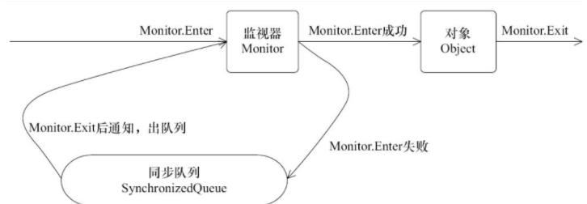
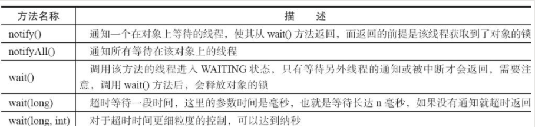
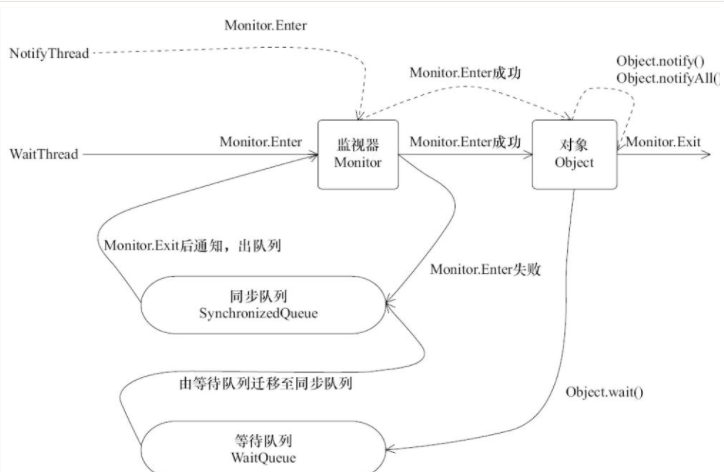

# Java 中的等待通知机制与 Thread.join

## Synchronized 的实现

Java 关键字 synchronized 可以修饰方法或者以同步块的形式来使用，他可以确保多个线程在同一时刻，只能有一个线程处于方法或者同步块中，它保证了线程对变量访问的可见性和排他性。

任意一个对象都拥有自己的监视器，当这个对象由同步块或者这个对象的同步方法调用时，执行方法的线程必须先获取到该对象的监视器 monitor 才能进入同步块或者同步方法，而没有获取到监视器的线程则将会被阻塞在同步块和同步方法的入口处，进入 BLOCKED 状态，并被放入同步队列中。 

当获取了锁的线程释放了锁，则释放操作会唤醒阻塞在同步队列中的线程，使其重新尝试获取监视器。 




## 等待/通知机制

一个线程修改了一个对象的值，希望让另外一个线程感知到并执行相应的操作。 这种生产者 + 消费者的模型，在功能层面上实现了接耦。 在 Java 中，可以通过内置的等待/通知机制来实现实现这个模式。 

等待/通知的相关方法是任意 Java 对象都具备的，因为这个方法被定义在 `java.lang.Object` 上，方法和描述图所示。 



需要注意以下几点

1. 使用 wait(), notify() 和 notifyAll() 时，都需要先将调用对象加锁。 
2. 调用 wait 方法后，线程状态将会由 RUNNING (Java 中 RUNNING 和 READY 被合并为了 RUNNABLE) 变成 WAITING，并且将当前线程放置到对象的等待队列中。 
3. notify 和 notifyAll 方法调用后，等待线程并不会立刻从 wait 方法处返回，而是需要等待 notify 或 notifyAll 的线程释放掉锁之后，等待线程才会**有机会** 从wait 方法处返回。 
4. notify 方法将等待队列中的一个等待线程从等待队列移到同步队列中，而notifyAll 方法则是将等待队列中所有线程全部移到同步队列中，被移动的线程状态由 WAITING 变成 BLOCKED。 可见，BLOCKED 是 WAITING 状态线程恢复运行的必经之路。 

5. 从 wait 方法返回的前提是获取到了调用对象的锁。 




## 等待/通知模型的经典范式

等待方(消费者) 和 通知方(生产者) 可以参照如下范式进行设计

对于等待方

1. 获取对象的锁
2. 如果条件不满足，调用锁对象的 wait 方法，被通知后仍然要检查条件。 
3. 条件满足则执行对应的逻辑。 

```java
synchronized(对象) {
  while (条件不满足) {
    对象.wait()
  }
  对应的处理逻辑
}
```


通知方遵循如下的原则

1. 获得对象的锁
2. 改变条件
3. 通知所有等待在对象上的线程

```java
synchronized (对象) {
    改变对象
    对象.notifyAll()
}
```


## Thread.join() 是如何实现的

如果线程 A 执行 thread.join() 语句，其含义是当前线程 A 等待 thread 线程终止之后才从 thread.join() 处放回继续执行。除了 join() 方法外， 还提供了 join(long millis) 和 join(long millis, int nanos) 两个具备超时特性的方法。 

Thread.join() 在底层也是基于wait notify 来实现的。 

```java
// Thread.java
public final synchronized void join() throws InterruptedException {
    // 条件不满足，继续等待
  	while (isAlive()) {
      wait(0);
    }
    // 条件符合，方法返回
}
```

当线程终止时，会调用线程自身的 notifyAll 方法，会通知所有等待在该线程对象上的线程。 

## 等待超时的经典范式

开发中经常遇到的一个场景是调用一个方法时等待一段时间（一般来说是一个时间段），如果该方法在时间段内得到结果，就立即返回，否则返回默认结果或抛出一场。 

我们只需要对前面的等待/通知模型进行小小的改造，就可以实现这个功能。 

假设超时时间段是 T，那么可以推断出在 now + T 之后就会超时

定义如下变量：

- 等待持续时间：REMAINING = T
- 超时时间：FUTURE = now + T

这是仅需要 wait(REMAINING) 即可，在 wait(REMAINING) 返回之后会继续执行; REMAINING = future - now。 如果 REMAINIG 小于等于0，表示已经超时，直接退出，否则将继续执行 wait(REMAINING)

```java
// 对当前对象加锁
public synchronized Object get(long mills) throws INterruptedException {
    long future = System.currentTimeMillis() + mills;
    long remaining = mills;
    while(result == null && remaining > 0) {
        wait(remaining);
        remaining = future - System.currentTimeMillis();
    }
    return result;
}
```

