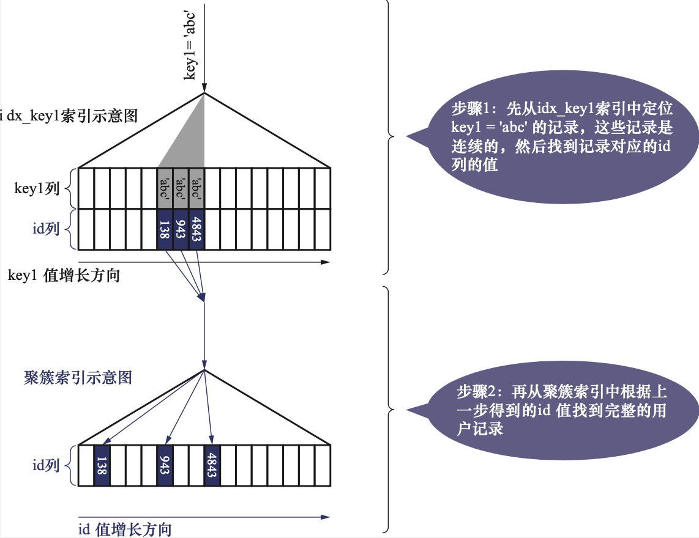
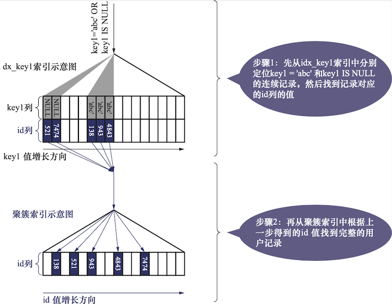

# MySQL 单表访问方法（access method)

MySQL 执行查询语句的方式称为访问方法（access method)，同一个查询语句可以使用多种不同的访问方法来执行，最后的查询结果是一样的。 但是不同的执行方式花费的时间成本可能差距巨大。 就像到二仙桥，有无数种走法，但是最佳的一定是走成华大道，MySQL 也会选取最佳的访问方法来进行查询。 

假定有这样一张表

```sql
CREATE TABLE single_table (
    id INT NOT NULL AUTO_INCREMENT,
  key1 VARCHAR(100),
  key2 INT,
  key3 VARCHAR(100),
  key_part_1 VARCHAR(100),
  key_part_2 VARCHAR(100),
  key_part_3 VARCHAR(100),
  common_field VARCHAR(100),
  PRIMARY KEY (id),
  KEY idx_key1(key1),
  UNIQUE KEY uk_key2(key2),
  KEY idx_key3(key3),
  KEY idx_key_part(key_part_1, key_part_2, key_part_3)
) Engine= InnoDB CHARSET=utf8;
```

## const

使用主键索引或者唯一二级索引列与常量进行等值比较来定位**一条**记录的查询，像坐火箭一样快，耗费的时间是常数级(const)级的，代价可以忽略。 这种查询方式被称为 const 方式。例如：

```sql
SELECT * FROM single_table WHERE id = 1438;
```

```sql
SELECT * FROM single_table where key2 = 100;
```

这两条 SQL 都会使用 const 访问方式，因为他们通过主键索引或唯一二级索引与常量进行等值比较查询，能够唯一确定不超过1条记录，查询速度飞快。 

## ref

当使用某个普通的二级索引与常量进行等值比较查询时，例如

```sql
SELECT * from single_table where key1='abc';
```

由于是普通的二级索引，所以查询结果可能并不唯一，需要根据 idx_key1 来进行区间扫描，即扫描 ['abc', 'abc'] 这个范围内的所有值。 由于查找的值是 * , 索引不能覆盖查询范围，所以需要回表。 其完整的查询过程如下。 



如果['abc', 'abc'] 区间的二级索引记录数量比较少，回表还是比较快的。 

这种搜索条件为二级索引列与常量进行等值比较，形成的扫描区间为单点扫描区间，采用二级索引来进行查询的访问方式成为 **ref**。 

有两种特殊情况需要注意:

1. 当二级索引允许存储 NULL 值时，无论索引是唯一二级索引还是普通二级索引，都不会限制 NULL 值的数量，所以下面这条 SQL ，使用的也是 ref 索引。

```sql
SELECT * FROM single_table where key2 IS NULL;
```

2. 对于索引列中包含多个列的二级索引，只要最左边连续的列是与常数进行等值比较的，就可以使用 ref 方式进行执行。 例如
   
   ```sql
   -- ref 
   SELECT * FROM single_table where key_part1 = "hello";
   SELECT * FROM single_table where key_part2 = "hello" AND key_part2 = "world";
   -- 非 ref
   SELECT * FROM single_table where key_part1 = "hello" and key_part2 > "world";
   ```

## ref_or_null

顾命思意，当不仅想找出某个二级索引列的值等于某个常量的记录，而且还想找出该列中值为 NULL 的记录时，如果使用的是二级索引而不是全表扫描，那么就是 ref_or_null 查询方式。 

例如

```sql
SELECT * FROM single_table WHERE key1 = "abc" OR key1 IS NULL;
```

此时索引的扫描范围为 [NULL, NULL] 以及 ['abc', 'abc']，其执行过程如下图



可见， ref_or_null 访问方法，只是比 ref 访问多扫描了一些值为 NULL 的二级索引记录。 

:::tip

从这里可以看出，NULL 值是排在索引的的最左边的。 

:::

## range

当对索引列与某个常数进行等值比较时，才会使用到 const、ref、ref_or_null 的访问方式。 但是有时我们面对的搜索条件很复杂，例如

```sql
SELECT * FROM single_table where key2 in (1438, 6328) OR (key2 >= 38 AND key2 <= 79);
```

如果使用 idx_key2 索引执行这条查询，对应的扫描区间是[1438, 1438], [6328, 6328], [38, 79]。 这种“使用索引执行查询时，对应的扫描区间为若干个单点扫描区间或范围扫描区间”的访问方式，称为 range 方式。 

注意，仅包含一个单点扫描区间或者扫描区间为 (-∞ , + ∞) 的访问方式也不是 range 访问。 

## index

这个直接看例子

```sql
SELECT key_part1, key_part2, key_part3 FROM single_table WHERE key_part2 = 'abc';
```

由于 key_part2 并不是联合索引 idx_key_part 的索引列中最左边的列， 所以无法形成合适的扫描区间来减少需要扫描的记录数量。 从而无法使用 range 或 ref 访问来执行这个语句。 但是，这个查询符合下面两个条件

1. 查询列表只有 key_part1, key_part2, key_part3，而索引 idx_key_part 又刚好包含这三个列。 
2. 搜索条件只有 key_part2 列，这个列也包含在了索引 idx_key_part 中。 

通常，二级索引要比聚簇索引小的多， 所以，这条查询最终使用 idx_key_part 索引，扫描范围是  (-∞ , + ∞) ，因为查询范围刚好被 idx_key_part 索引覆盖无需执行回表操作。  这种扫描全部二级索引记录的访问方式称为 index 访问方法，其特点是无需回表。 

另外，当通过全表扫描对使用 InnoDB 存储引擎的表执行查询时，如果添加了 `ORDER BY 主键` 那么该查询也会被认为是 index 访问方式。 

## all

all是最直接的查询方式，全表扫描，对于InnoDB来说，就是直接扫描访问全部的聚簇索引记录。 

## index_merge

index_merge 即索引合并。 MySQL 一般情况下只会为单个索引生成扫描区间，然后结合回表过滤来完成查询。 但是还存在一些特殊情况会同时为多个索引生成扫描区间。 

### Intersection 索引合并

```sql
SELECT * FROM single_table WHERE key1 = 'a' and key3 = 'b'
```

上面这个SQL，查询方式有多种，我们可以选择全表扫描，当然这很不靠谱，也可以选择先根据 key1 或 key3 生成扫描区间，然后查询对应的索引，在根据索引记录中的主键值，回表查询完整的用户记录。 

其实，还有一种方案，同时使用 idx_key1 和 idx_key3 索引，即在 idx_key1 中扫描 key1 值在范围['a', 'a']区间中的二级索引记录，同时在 idx_key3 中扫描 key3 值在 ['b', 'b'] 范围内的索引记录。 然后再从两者的操作结果中，找出相同的主键 id 的记录。 然后再对这些共有的 id 值执行回表操作。这样能够节省下很多回表操作带来的开销。 

这种方案就是 Intersection 索引合并，即交集索引合并。 

需要注意的是，这种查询方式要求每个索引中获取到的二级索引记录都是按照主键值排序的，下面这个例子就不能满足

```sql
SELECT * FROM single_table WHERE key1 > 'a' and key3 = 'b';
```

其中 idx_key1 的扫描范围为 ['a', +∞]，并不是按照主键ID 排列的。 为什么二级索引记录都是按照主键排序的？

1. 两个有序集合的交集比两个无序集合的交集要快和容易。
2. 如果获取到的id值是有序的，那么回表时效率更高。

### Union 索引合并

```sql
SELECT * FROM single_table WHERE key1 = 'a' OR key3 = 'b'
```

与 Intersection 类似，这条语句也是分别在 idx_key1 和 idx_key3 中查询二级索引记录，然后对主键 id 取并集后再回表。 其要求也是每个索引中获取到的二级索引记录都是按照主键 ID 排序的。 

### Sort-Union 索引合并

```sql
SELECT * FROM single_table WHERE key1 < 'a' OR 'key3' > 'z'
```

这条记录显然不符合 UNION 索引合并的条件，但是我们可以先查询两个索引，对每个索引中的主键索引执行内存排序，内存排序后再取并集进行回表查询。

我们把这种先将从各个索引中扫描到的记录的主键值进行排序，然后执行 UNION 索引合并的方式进行查询的方式，成为 Sort-Union 索引合并。 很显然， Sort-Union 比 Union 索引合并多了一步排序的过程。 

:::note

MySQL 中没有 Sort-Intersection, 不过 MariaDB 中有

:::