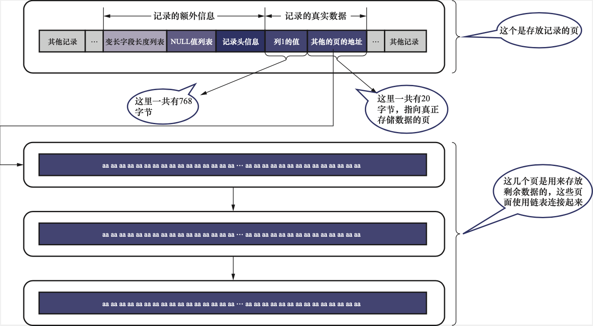

# MySQL InnoDB 行、页的结构

## InnoDB 行格式

我们使用 MySQL 数据库时，都是以记录为单位向表中插入数据。但根据存储引擎的不同，记录在磁盘上的存储格式其实是不同的。我们把记录在磁盘上的存储形式称之为行格式或记录格式。

在 InnoDB 中，行格式有 COMPACT、REDUNDANT、DYNAMIC 和 COMPRESSED 四种。 可以在创建表时，指定使用的行记录格式

```sql
CREATE TABLE 表名 (列的信息) ROW_FORMAT=行记录格式
```

### COMPACT 行格式

COMPACT 格式分为记录的额外信息和记录的真实数据两部分。


#### 1.记录的额外信息

这部分信息主要存储引擎为了更好的管理记录而添加的一些额外信息, 分为三个部分，变长字段长度列表、NULL值列表和记录头信息。 

(1) 变长字段长度列表

MySQL 支持一些长度不定的数据类型，例如 VARCHAR(M),VARBINARRY(M) 以及各种TEXT, 各种BLOB，因此需要将这些数据占用的字节数也一并存下来，才能正确读取数据。 也就是说，变长类型的数据类型真正的存储是分为两个部分的，即：

- 真正的数据内容

- 该数据占用的字节数

在 COMPACT 类型行格式中，所有变长字段占用的字节数都存放在记录开头的位置，形成一个变长字段长度列表，各个变长字读字段真实数据占用的字节数按照列的顺序逆序存放。 

另外需要注意的一个数据类型是 CHAR(M)， CHAR(M) 看起来是固定长度的数据类型，但当使用的编码为变长编码，例如UTF-8 时，也会被视为变长字段。 

(2) NULL 值列表

一条记录中的某些列值可以是NULL，如果把这些 NULL 值都放到记录的真是数据中会很占空间，所以 COMPACT 行格式把一条记录中值为 NULL 的列统一管理，存储到 NULL 值列表中。 COMPACT 行格式是使用 bitmap 的形式来标记某一列是否为 NULL的，即某 bit 为 1 时，表示该列的值为 NULL。 同时要求 NULL 值列表长度必须为整数个字节，不足时高位补0。

(3) 记录头信息

记录头信息由固定的5个字节组成，用于描述记录的一些属性。

| 名称           | 大小（位） | 描述                                                                                      |
| ------------ | ----- | --------------------------------------------------------------------------------------- |
| 预留位1         | 1     | 没有使用                                                                                    |
| 预留位2         | 1     | 没有使用                                                                                    |
| delete_flag  | 1     | 标记记录是否被删除                                                                               |
| min_rec_flag | 1     | B+ 树每层非叶子节点中最小的目录项记录会被添加该标记                                                             |
| n_owned      | 4     | 一个页面中的记录会被分成若干个组，每个组中由一个记录是“带头大哥”，其余的记录都是“小弟”，“带头大哥”记录的n_owned值代表该组中的所有的记录条数，“小弟”记录的值为0 |
| heap_no      | 13    | 表示当前记录在页面堆中的相对位置                                                                        |
| record_type  | 3     | 表示当前记录的类型，0 表示普通记录，1 表示 B+ 树非叶子节点的目录项记录，2 表示 Infimum 记录，3 表示 Superemum 记录               |
| next_record  | 16    | 表示下一条记录的相对位置                                                                            |

#### 2. 记录的真实数据

隐藏列

记录中除了我们自己定义的列数据外，MySQL 还会为每个记录添加一些隐藏的列。

| 字段          | 作用                               | 长度     |
| ----------- | -------------------------------- | ------ |
| DB_ROW_ID   | 唯一标识一行记录的ID，单调递增                 | 6-byte |
| DB_TRX_ID   | 事务ID，标识了最后一次插入或者更新行的事务，注意，删除也是更新 | 6-byte |
| DB_ROLL_PTR | 回滚指针，指向 undo log 中的记录            | 7-byte |

> MySQL 的主键生成策略：优先使用用户自定义的主键作为主键，如果没有，那么选取一个不允许存储 NULL 值的 UNIQUE 键作为主键。 如果还没有，则自动添加 DB_ROW_ID 作为主键，因此 DB_ROW_ID并不是一定存在的。 

### REDUNDANT 行格式

REDUNDANT 格式是最早的行格式。


这里主要记录下与 COMPACT 类型的区别。

#### 1. 字段长度偏移列表

COMPACT 格式的开头是可变字段长度列表，而 REDUNDANT 格式的开头是字段长度偏移列表，他们有两处区别：

- 没有了变长，即 REDUNDANT 会把该记录中所有字段的长度信息都记录下来。 
- 多了个偏移，即 REDUNDANT 需要通过两个相邻偏移量的差来确定每个列的长度。

#### 2. 记录头信息

REDUNDANT 记录头信息由 6 个字节组成

| 名称            | 大小（位） | 描述                                                         |
| --------------- | ---------- | ------------------------------------------------------------ |
| 预留位1         | 1          | 没有使用                                                     |
| 预留位2         | 1          | 没有使用                                                     |
| delete_flag     | 1          | 标记记录是否被删除                                           |
| min_rec_flag    | 1          | B+ 树每层非叶子节点中最小的目录项记录会被添加该标记          |
| n_owned         | 4          | 一个页面中的记录会被分成若干个组，每个组中由一个记录是“带头大哥”，其余的记录都是“小弟”，“带头大哥”记录的n_owned值代表该组中的所有的记录条数，“小弟”记录的值为0 |
| heap_no         | 13         | 表示当前记录在页面堆中的相对位置                             |
| n_field         | 10         | 表示记录中列的数量                                           |
| 1byte_offs_flag | 1          | 标记字段长度偏移列表中每个列对应的偏移量是使用1字节还是2字节来表示 |
| next_record     | 16         | 表示下一条记录的相对位置                                     |

#### 3. NULL 值处理

REDUNDANT 行格式没有 NULL 值列表，而是使用字段长度偏移列表中各列对应偏移量值的第一个字节来标记是否为 NULL 值。 

#### 4. CHAR(M) 的存储

在 COMPACT 格式中， CHAR(M) 列如果使用了变长编码，则存储相同数量字符时，实际占用的字节数可能是不同的。 而在 REDUNDANT 中， CHAR(M) 简单粗暴的存储为编码方式中字符编码的最长字节数量 X M。 例如 CHAR(10) 如果使用 UTF8mb4 编码，则占用的空间大小固定为 40 字节。 

### 溢出列

InnoDB 是以页为单位来管理存储空间了，记录会被分配到某个页中进行存储，通常每个页的大小为 16KB，即 16384 字节， 但是一条记录的记录很可能会超过 16KB，例如存满数据的 VARCHAR(65532)。 

在 COMPACT 和 REDUNDANT 行格式中，对于存储空间非常多的列， 在记录数据时，只会存储该列的一部分数据，而把剩余的数据分散存储在几个其他页中，然后在记录中使用20个字节存储指向这些页的地址，从而找到剩余数据所在的页。 



### DYNAMIC 行格式 和 COMPRESSED 行格式

这两个行格式与 COMPACT 行格式很相似，只不过在处理溢出列时稍有区别，它们不会在记录中存储该溢出列真实数据的前 768 字节，而是将该列的全部数据都存储到溢出页里，只存储指向溢出页的地址。 

COMPRESSED 行也是与 DYNAMIC 行格式的区别在于 COMPRESSED 会使用压缩算法对记录进行压缩以节省空间。 

DYNAMIC 是 MySQL 5.7 的默认行格式。 

## 参考资料

1. https://dev.mysql.com/doc/refman/8.0/en/innodb-row-format.html
2. https://mariadb.com/kb/en/innodb-row-formats/
3. 《MySQL 是怎样运行的：从根上理解 MySQL》